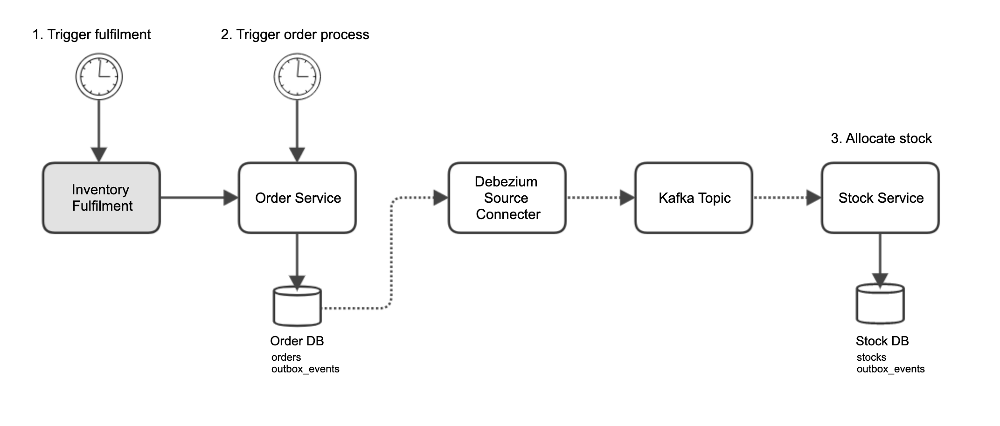
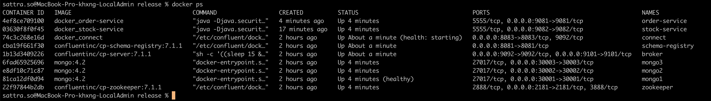

# Spring-Boot Outbox Pattern

### Description
This is spring-boot outbox pattern example.

### Presentation
[Apache Kafka Meetup 2nd - Event Driven Architecture in TD Retail Platform](./asset/apache_kafka_meetup.pdf)

### Use case


### Features
- [x] Order Service
- [x] Stock Service
- [ ] Inventory fulfilment
- [x] MongoDB Replica
- [x] Kafka and Connector
- [x] Sample Data

### Build package then run docker compose
 ```bash
./mvnw clean install
docker-compose -f docker/docker-compose.yml up -d
 ```

### Ensure docker containers are up and running



### Run test via order service
 ```bash
# Get order no. OD-001
curl --location --request GET 'http://localhost:9081/orders/OD-000005'

# Create new order no. OD-100001 as status "NEW"
curl --location --request POST 'http://localhost:9081/orders' \
--header 'Content-Type: application/json' \
--data-raw '{"version":0,"orderNo":"OD-100001","orderDate":"2022-08-16T13:41:20.441+00:00","deliveryDate":"2022-08-16T13:41:20.441+00:00","status":"NEW","storeCode":"TH-100001","storeName":"ถูกดี มีมาตราฐาน","items":[{"barcode":"001","qty":20},{"barcode":"002","qty":50}]}'
 
 # Update order no. OD-100001 to status "PROCESSING". At this step, stock will be allocated for this processing order. 
curl --location --request PATCH 'http://localhost:9081/orders/OD-100001/processing'
 ```

### Logging
 ```bash
docker logs -f order-service
docker logs -f stock-service
docker logs -f connect

curl -s -X PUT -H "Content-Type:application/json" \
http://localhost:8083/admin/loggers/io.debezium \
-d '{"level": "TRACE"}' | jq '.'

curl -s -X PUT -H "Content-Type:application/json" \
http://localhost:8083/admin/loggers/org.mongodb \
-d '{"level": "DEBUG"}' | jq '.'
 ```

### References
- https://microservices.io/patterns/data/transactional-outbox.html
- https://debezium.io/documentation/reference/stable/connectors/mongodb.html
- https://www.mongodb.com/docs/manual/core/replica-set-oplog
